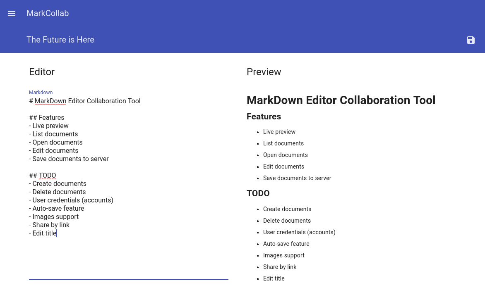

# MarkCollab Editor

## Description

MarkCollab is a simple collaboration tool for creating various types of documents using Markdown syntax. The main idea is to create a self-hosted Web Application that contains everything to create Markdown documents by many people in the same time.

## Screenshots




## API Reference

### Get all documents
```http
GET {root}/api/docs
```

### Get single document of {id}
```http
GET {root}/api/docs/{id}
```

### Create new document with title in body
```http
POST {root}/api/docs
```
> Note: Remember to add `Content-Type: text/plain` header.

### Update document content in body
```http
PATCH {root}/api/docs/{id}/content
```
> Note: Remember to add `Content-Type: text/plain` header.

### Update document title in body
```http
PATCH {root}/api/docs/{id}/title
```
> Note: Remember to add `Content-Type: text/plain` header.

### Delete document of {id}
```http
DELETE {root}/api/docs/{id}
```