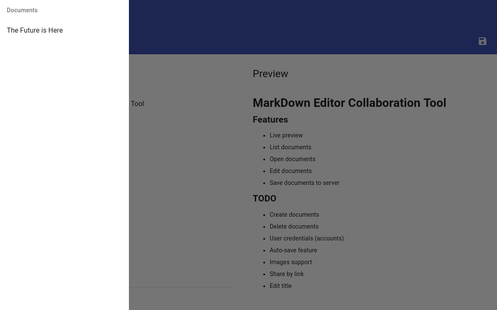

# MarkCollab Editor

<!-- TOC -->

- [Overview](#overview)
- [Screenshots](#screenshots)

<!-- /TOC -->

## Overview

MarkCollab is a simple collaboration tool for creating various types of documents using Markdown syntax. The main idea is to create a self-hosted Web Application that contains everything to create Markdown documents by many people in the same time.

## Screenshots

